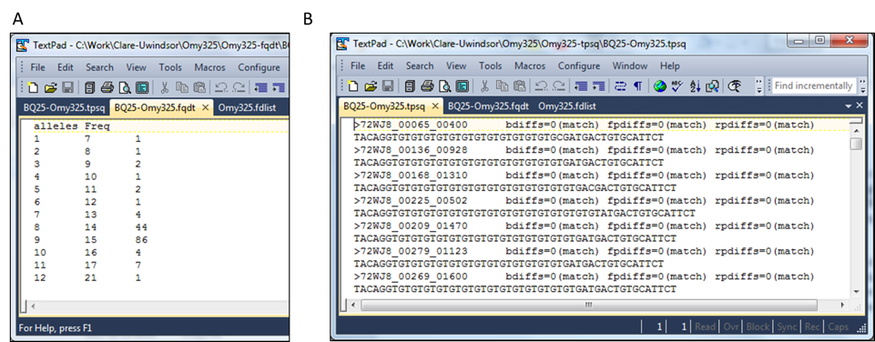
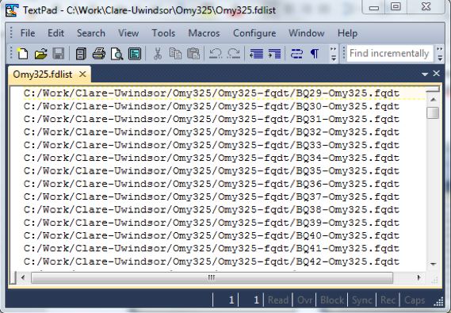
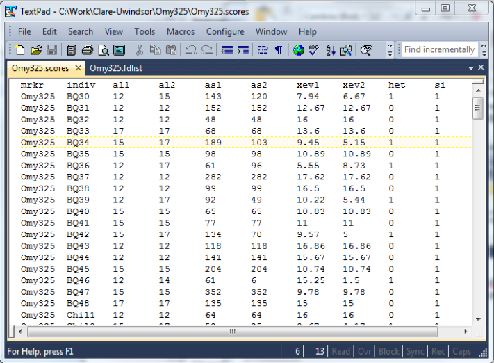
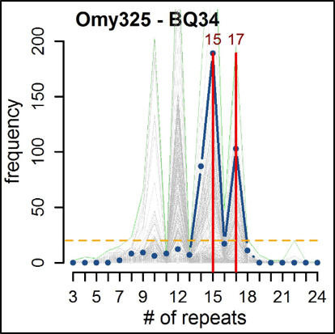
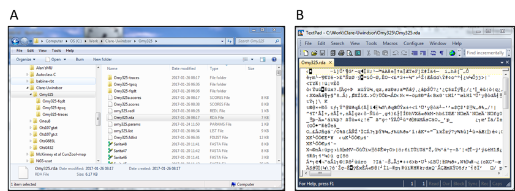
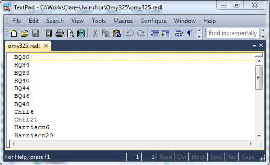
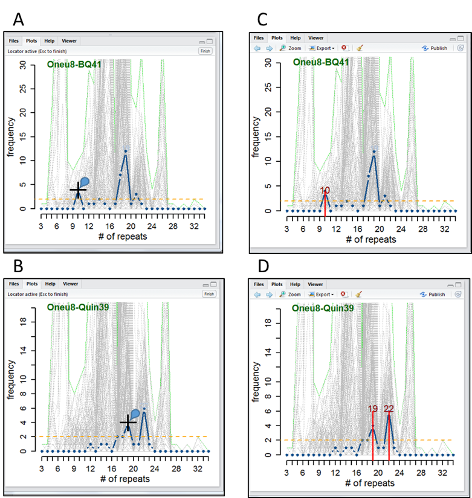

# NGS-usat 1.0

### An R based bioinformatics framework for scoring microsatellites generated from next generation sequencing platforms.

Denis Roy1, Sarah Lehnert2, Clare Venney2, Ryan Walter3 and Daniel D. Heath2

Release 1.0 — Sept 2017

1- Natural Resource Sciences, McGill University, 21111 Rue Lakeshore Road, Sainte-Anne-de-Bellevue, QC, H9X 3V9

2- Great Lakes Institute for Environmental Research, University of Windsor, 401 Sunset Ave. Windsor ON, Canada, N9B 3P4

3- Department of Biological Science, California State University at Fullerton, Fullerton, CA USA 92831

## 1 – System requirements & suggestions: (what has worked for us during development)

**1.1 –** NGS-usat scripts were written using R version 3.4.0, but have since been updated to run with latest R (3.4.1). See instructions from the CRAN website (https://cran.r-project.org/) on how to download and install R, depending on your platform. All packages and dependencies for the scripts have also been updated to their most recent versions and these can be accessed through your favourite CRAN mirror (we suggest the one at Dal). Instructions on how to download and install packages from the CRAN mirrors, and from the BIOCONDUCTOR sources are also available online (see https://www.r-bloggers.com/installing-r-packages/ and https://www.bioconductor.org/install/, respectively).

**1.2 –** In RStudio/R the following packages need to be installed from the CRAN mirror or BIOCONDUCTOR sources (see 1.1 above).
* R packages: zoo, xts, TTR, pracma, parallel, tcltk, foreach, plyr, dplyr, data.table 
* BIOCONDUCTOR packages: BiocGenerics, IRanges, XVector, S4Vectors, Biostrings, 

Appropriate packages will be loaded automatically once the program is initiated, but package libraries need to be installed for them to be accessible.

**1.3 –** Much of the processing and manipulation for NGS-usat is accomplished rather easily using the RStudio framework (https://www.rstudio.com/products/rstudio/download/). This is not essential, but it does make visualisation and updating the scores much easier. The version of RStudio used here is 1.0.136. 

**1.4 –** MacOS users need to have the latest XQuartz application loaded properly in their root system. Otherwise updating the scores will not load on your machines. Instructions on how to do this, and the application itself, are available at the link provided (https://www.xquartz.org/). 

* PLEASE NOTE! RStudio works on Mac/Windows/Unix/Linux platforms, but the latest Mac and Windows version is 64bit only. This means the JAVA version on Windows has to be the 64bit application which is available here (https://java.com/en/download/faq/java_win64bit.xml#Java%20for%2064-bit). On Macs the newest OS (Sierra 10.12.6) still doesn’t incorporate the XQuartz.app. So, even if you end up using the latest RStudio to run the NGS-usat scripts, the updated XQuartz app is still needed.

**1.5 –** For list creation and manipulation, we recommend using Textpad® in Windows. However, any basic text editor will do, so long as it doesn’t introduce silent/unseen characters (MS WORD is NOT a good candidate). MacOS users can find the equivalent (or better) text manipulation using TextWrangler®. Both are free and easily installed.

## 2 – NGS-usat Introduction and Setup:

**2.1 –** NGS-usat is a series of scripts written in R that will allow automatic and fast genotyping of individuals sequenced at a series of microsatellites using NGS platforms. The scripts are essentially platform independent and so, ought to work with both Ion Torrent and Illumina sequence reads, as long as the raw data (in fasta/fastq format) for each individual and locus can be demultiplexed first. Data demultiplexing can be performed using other freely available software packages (we recommend the RDpipeline available here: http://rdp.cme.msu.edu/).

The easiest way to run the scripts is through the RStudio interface. Once RStudio is loaded and running, open the scripts in the ‘sourcing’ tab (Figure 1). Highlight the script in its entirety and press the enter/return key while holding down the CTRL/CMD key (in Windows or Mac, respectively). This will activate the script(s) and will prompt users for appropriate files. 

* PLEASE NOTE! Most scripts prompt the user for at least one file. So, if it looks as if R has stalled, it may very likely be that there is a dialog box waiting for user input. It might be wise to leave part of the desktop available to see ‘file choose’ dialog boxes. 

  

**Figure 1. An example of the R/RStudio setup to run the NGS-usat scripts. The NGS-usat scripts are loaded in different tabs in the sourcing panel in the top-left corner (highlighted in blue).**

**2.2 –** The ‘prepare_data.R’ script is the script that reads and reformats the raw demultiplexed ‘.fasta’ or ‘.fastq’ files. So, there should be no ‘formatting’ of the raw data needed. However, to make the script run, the database in which the files are stored ought to have a particular structure. This structure should be intuitive.

The raw files ought to have been de-multiplexed to separate-out runs of individual loci and of individual samples. The files for all individuals processed at a given locus ought to be placed in a separate folder with the name of the locus. So, for example, the files for all individuals genotyped at “Omy325” are put into a “Omy325” folder (Figure 2).

  

**Figure 2. Database structure for NGS-usat, where all ‘.fasta’ or ‘.fastq’ files for a given locus are placed in a locus-specific folder.**

**2.3 –** The next step is to create a list file of the data to process for each locus. The list file is just a text based file listing all individual ‘.fasta’ or ‘.fastq’ files (hopefully corresponding to individuals genotyped) for a given locus. The file ought to have the simple header “ind” and each entry should include the path and filename of the files to be processed. The example below shows a typical list file (Figure 3). 

  

**Figure 3. Typical list file generated for running the NGS-usat series of scripts. Each new locus processed ought to have its own list file listing all files to be processed (including path and filename). All list files ought to also have the ‘ind’ header on the first line.**

* Hint: to make a list file in Windows systems, highlight the files and hold down the shift key while pressing the right mouse button. This will show a dialog box with the "copy as path" option. Use this option and paste the text in textpad. 

**2.4 –** A ‘.params’ parameter file is also needed to process the data (Figure 4). This file lists the name of the usat being processed (should be near 6 alphanumeric characters, but slightly longer also works), the actual repeat and the most likely usat flanking regions. The repeat unit(s) of the microsatellites to be processed must be specified, because this is what the script ‘looks’ for. Misidentification here can lead to several issues, chief among them being messy and non-sensical calls. NGS-usat will not identify new microsatellite loci in raw sequence data. Other programs can do this but these are more sequence mining softwares. NGS-usat does not fall into this category. IT IS STRICTLY USED FOR ALREADY DEVELOPED USAT LOCI. 

* PLEASE NOTE! Although the repeat unit must be specified correctly, much less stringencies are applied to the flanking regions surrounding the microsatellite. The forward flanking region (ffr) and the reverse flanking region (rfr) may or may not be specified. Moreover, if specified, they can simply be a ‘best guess’ to actual flanking regions and the script(s) are flexible enough to trim them even if the matches aren’t perfect. Even if some, or the entire flanking regions aren’t trimmed, the script(s) essentially ignore sequence outside the repeats, irrespective of whether the flanking regions are trimmed or not. Having said this, the script(s) is much more efficient when flanking regions have been removed. 

  

**Figure 4. An example ‘.params’ file essential for preparing and scoring microsatellite data, listing the marker, the repeat (obligatory) and the forward, and reverse flanking regions (optional).**

## 3 – Preparing the data “prepare_data.R”

**3.1 –** Once the ‘.list’ and the ‘.params’ files have been generated, the initial ‘prepare_data.R’ script can be opened and run (see section 2.1 above). The script will prompt the user for files for pre-processing. The script asks for the ‘.list’ file first, then the ‘.params’ file, in that order. Supplying the files in the opposite order will cause the script to crash.

**3.2 –** If the script runs correctly, it ought to generate two new folders into which it saves files of individual-based frequency distribution (hereafter FD) of counted repeats (‘.fqdt’ file in the X-fqdt folder, where X is the marker name; Figure 5a), and list of trimmed sequences (‘.tpsq’ files in the X-tpsq folder; Figure 5b). The FD files and folder are essential for subsequent scripts in the NGS-usat program, but both ‘.fqdt’ and ‘.tpsq’ files can be used to troubleshoot/verify/score the data using algorithms and softwares other than the ones provided in the subsequent script(s).

  

**Figure 5. (a) Resulting ‘X.fqdt’ file showing the FD of repeats counted for individual ‘BQ25’ at locus Omy325, and (b) ‘X.tpsq’ file showing the trimmed sequences used to make the FR in (a) by counting the repeats in each sequence.**

**3.3 –** If the script crashes, before running through all the data, typing:

"> idnum"

Should give you the index of the individual file that caused the crash. If you need help, contacting me and providing the data and a detailed description of how things crashed (including the individual on which the script balked), will help us figure out issues.

**3.4 –** The script also ought to generate a ‘.fdlist’ file, which automatically lists the files in the newly generated ‘X-fqdt’ folder where with their path and filename (Figure 6). This is the file (and folder with files) used in subsequent scripts.

  

**Figure 6. ‘.fdlist’ file automatically generated from the ‘prepare_data.R’ script, outlines the path and filename for FD of repeats calculated for each individual file included in the initial processing.** 

## 4 – Automatic scoring “autoscr_locus.R”

**4.1 –** The next script to run is ‘autoscr_locus.R’. This script does most of the heavy work. It reads all of the files listed in ‘.fdlist’ and concatenates the FDs into a giant datatable for manipulation (essentially, a very crude allele alignment tool).

The datatable is used to get an overall estimate of the locus’ allelic profile outlining the max frequencies observed at all possible alleles (mxfr entry in the ‘–traces’ folder) and estimates the preponderance of scores at each over the entire dataset.  

The script then uses a peak finding, and both a pre- and post- peak scanning, algorithms to call the most likely alleles from the FD of each allelic profile (i.e., individual). The algorithms include an assessment of likely studder,  the number of sequences supporting each allele call and the deviation of each called allele from a uniform distribution of all possible alleles contributing to sum distribution (over all alleles and individuals). This information, for each individual, populates a standardised text based tab delimited ‘.scores’ file (Figure 7), which can be imported into most data management and manipulation software such as R, Numbers, SPSS or Excel etc,…

  

**Figure 7. ‘.scores’ file generated from the ‘autoscr_locus.R’ script. Data show the marker (mrkr), the individual processed (indiv), the automatically called alleles (al1, & al2), the number of sequences supporting each allele (as1 & as2), the amount by which each allele surpasses the expected uniform distribution (xev1, & xev2), whether individual is homo or heterozygote (het = 0 or 1, respectively) and the scoring iteration (si). The si lists the number of times the score has been assessed and is a tracker for the next script (update_score.R).**

**4.2 –** The ‘autoscr_locus.R’ script also spends a considerable amount of computing power generating allele visualisation profiles (AVPs: similar to chromatograms) or ‘traces’ that allow users to see what individual FD profiles look like with respect to the overall data and relative to all other individual-based scores (Figure 8).

  

**Figure 8. AVP (allele visualisation profile), or ‘trace’, for individual BQ34 scored at locus Omy325. The blue line outlines the individual’s profile while the grey lines show that of every other individual in the processed pool. The green line shows the maximum values at each allele over the entire processed pool and the yellow dashed line shows the expected uniform distribution (i.e., if all alleles contributed evenly to the pool wide FD). Red lines and numbers correspond to called  allelic scores for this individual, which are also saved to the ‘.scores’ file.**

Each individial’s trace is generated and saved as a ‘X.jpeg’ file (where X is the individuals index) into a new folder ‘Y-traces’ (where Y is the name of the locus processed). Each trace ought to be similar to figure 8 above, and can be checked by the user. 

* PLEASE NOTE! – It is important for users to check individual scores by looking at produced traces (or AVPs). This will allow users to determine if scores make sense and can be trusted. Although the automatic scoring algorithm seems to work well enough in general, there are always inherent errors and likely temperamental glitches in any autonomous scoring software. Consequently, it is important to check whether scores are believable and to what degree of confidence. Scores that seem ‘odd’ or even those that look in need of adjustment due to ‘missed’ alleles should be noted (by individual name) and a list can be made in your favourite text editor. 

**4.3 –** Once the data have been auto-scored, the traces for each individual at a scored locus ought to be verified by eye. This will allow the user to determine a list of potential ‘redos’ that can be re-scored interactively on-screen. This uses another script called ‘update_scores.R’, which reloads the R dataframe (‘.rda’ file), and uploads a list of individuals in need of scoring adjustments.

**4.4 –** ‘autoscr_locus.R’ also saves an ‘x.rda’ file to the working directory (Figure 9a). This file saves a series of important R objects generated by the script in the XDR platform independent binary format (Figure 9b) making them easily upload-able into new instances of R (Type ‘> help(save)’ for more details from R base documentation). This file becomes important as a reload in the subsequent script ‘update_scores.R’.

  

**Figure 9. (a) An ‘X.rda’ file containing R objects is placed in the working directory. These R objects are critical elements to recall in the subsequent script (‘update_scores.R’). (b) The information stored in ‘X.rda’ files are not easily accessible outside the R scripting platform but rather are compressed and saved in binary format.**

## 5 – Rescoring problematic individuals “update_scores.R”

**5.1 –** Inevitably, the scores produced by the ‘autoscr_locus.R’ script will have some issues. The next step in the process is to use the ‘update_scores.R’ script to adjust or re-score (if possible) problematic individuals. The ‘update_scores.R’ will need two files to run properly. The first is the ‘.rda’ file, which is (was) generated automatically after calling the ‘autoscr_locus.R’ script (see section 4.4 above). This file contains the previously generated R objects and is primarily used for indexing and regenerating allelic profiles. The second file is a list of individuals (individual names only) that need to be re-scored (Figure 10). 

**5.2 –** Redo list files MUST BE CORRECT and the spelling of each individual must match exactly that found in the ‘indiv’ column of the ‘.scores’ file produced from the ‘autoscr_locus.R’ script (Figure 7). A typo, or even a misplaces lower/uppercase value, will cause the screen updating process to stop, but will nevertheless update the ‘.scores’ file. This has the unwanted consequence of only updating some scores and another round of scoring updates must be initiated. This also means that keeping track of individual proper scores can become confusing if the updating process is interrupted prematurely. I suggest making a copies of the original ‘.scores’ and any other generated ‘.scores’ files before initiating a new update (before running the ‘update_scores.R’ script). This will make reference to initial automatic/previous updated scores much easier. I suggest copying the ‘indiv’ column in the ‘.scores’ file and eliminating the scores that do not need updating to create the ‘.redl’ list file (Figure 10). This avoids introducing typos from re-type a list of individuals by hand.

* PLEASE NOTE! In order for the ‘update_scores.R’ script to work properly on Mac OSX systems, the latest version of the XQuatrz app. needs to be properly installed in the root system. Instructions on how to do this have been described above (see section 1.3).

  

**Figure 10. An example of a redo list file (in this case named omy325.redl) listing individuals whose automatic scores (as visualised through traces) are in need of adjustments. Names of individuals were taken from the ‘omy325.scores’ file (see Figure 6).**

**5.3 –** Once the data file (‘.rda’) and the redo list (‘.redl’ or whatever extension was given) are read into R, the script will initiate a plot in the XQuartz (Mac OSX stand-alone R) or Plots display panel (RStudio). This plot ought to look similar to that shown in Figure 11A & B. The plot is essentially the same as the trace(s) created from the ‘autoscr_locus.R’ script except that the allele markers (in red) have been removed and the previous score attributed to the profile are in light blue colour (sometimes hard to see).

  

**Figure 11. (a & b) Initial plots of some redos for oneu8. The title has switch to green indicating that the figure is available for, or has been edited through, the ‘update_scores.R’ script. The information in the initial plots is similar to that described in Figure 7, but the allelic markers (in red) have been omitted. The previously established score for allelic profiles are displayed in light blue (sometimes difficult to see). The cursor is placed over the peaks of interest, and clicking the mouse re-scores the profile. (c & d) Once re-scored, the newly selected alleles appear on the plot and these are also updated both in the actual saved traces (in the ‘-traces’ folder) and in the ‘.scores’ file.**

**5.4 –** Scrolling over the plot should change the cursor to a crosshair that can be pointed to the desired peaks on the plot (See Figure 11 A & B, for example). Clicking the mouse when the cursor is over the desired peak re-establishes the score for that allelic profile (individual) both on the plot itself (updated in the ‘-traces’ folder) and in the ‘.scores’ file. A small blue balloon should appear when the selection of the allele (peak) is made (Figure 11 A & B). Once the peaks have been marked and the profile re-scored, the new selections ought to appear in red (as in the original AVP or ‘trace’) (Figure 9C & D). As soon as one profile is re-scored, the next is uploaded 

* PLEASE NOTE! Once a trace has been re-scored, attempting to change the scores again, by scrolling through the plots in RStudio will not work. To make further corrections, a new re-scoring procedure must be initiated (i.e., remaking another redo list). The re-scoring procedure can be initiated as many times as the user wishes. We recommend, however, to save the ‘.scores’ file under a different name after each run of the ‘update_scores.R’ script to keep track of the different scoring strategies for the data.

**5.5 –** After the ‘.scores’ file has been updated , individual locus scores can be imported into Excel and manipulated into a standard format for other freely available conversion softwares such as Convert (Glaubitz 2004), or PDGSpider (Lischer and Excoffier 2012). 

**5.6 –** Once the user is comfortable with the scores issued to each individual in the dataset, we recommend checking the scores for HWE and for the likely correct proportion of homo/heterozygotes in a program such as MICRO-CHECKER (van Oosterhout et al 2004). In our experience, odd proportions and large homozygous excess at particular loci are often related to heterozygotes being mis-called as homozygotes because of faint, but nevertheless present, secondary alleles. So, it is worth checking and if needed re-think the scoring strategies at particular loci after checking allele and genotypic frequencies in other independent softwares.

## 6 – NGS-usat disclaimer and note

**6.1 –** NGS-usat is freely available and was scripted in R so that it would essentially be platform independent and thus have broader use capacity. However, because it uses other R packages and modules in both R and BIOCONDUCTOR, and because Windows, Macs, Linux/Unix systems have different embedded defaults, it may be that the scripts work more efficiently in one system or another. Most of the scripts were written using MacOS, but the Windows version seems more stable and faster. For example, preparing and scoring the data for 191 individuals at locus Omy325 (clean locus) using the ‘prepare_data.R’ and the ‘autoscr_locus.r’ scripts took 1.126, and 12.049 minutes, respectively. This was run on a DELL Alien-AURORA_R4 system with 8 intel ® i7-3820 cores clocked at 3.60 GHz, 32 Gb RAM and a 64 bit operating Windows 7-Ultimate. It is important to note, however, that the scripts do not currently apply parallel computing techniques. The recommended setup (described in section 1) seemed to work best, but other alternative workflows may work as well. The authors make no claim that the scripts provided are error free and do not guarantee correct scoring. However, the scripts did take some time to write and troubleshoot (still ongoing) and, if they are useful and you use them for your data collection, please acknowledge this use in your work. 

Thank Q.  

