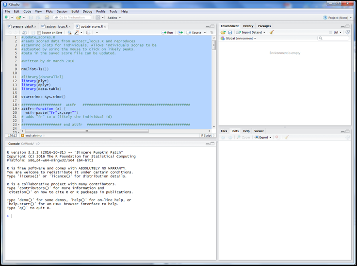
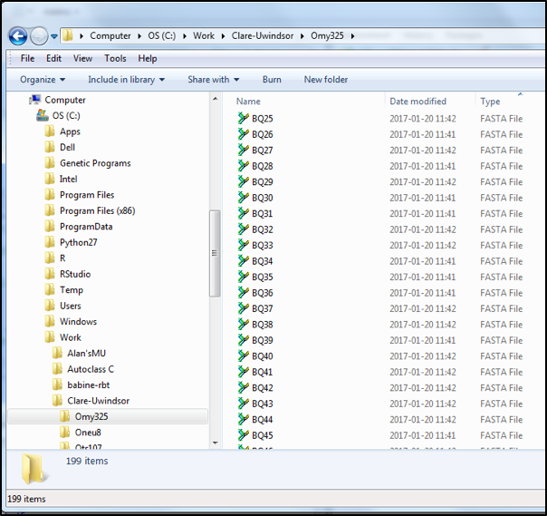
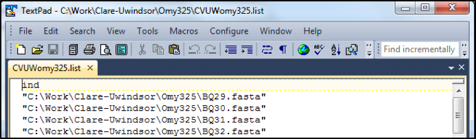
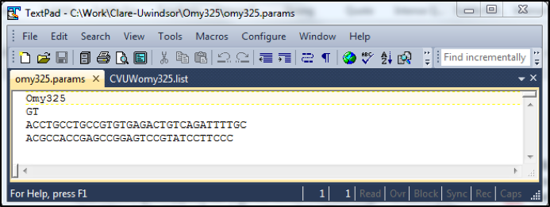

# NGS-usat 1.0

### An R based bioinformatics framework for scoring microsatellites generated from next generation sequencing platforms.

## 1 – System requirements & suggestions: (what has worked for us during development)

**1.1 –** NGS-usat scripts were written using R version 3.4.0, but have since been updated to run with latest R (3.4.1). See instructions from the CRAN website (https://cran.r-project.org/) on how to download and install R, depending on your platform. All packages and dependencies for the scripts have also been updated to their most recent versions and these can be accessed through your favourite CRAN mirror (we suggest the one at Dal). Instruction on how to download and install packages from the CRAN mirrors, and from the BIOCONDUCTOR sources are also available online (see https://www.r-bloggers.com/installing-r-packages/ and https://www.bioconductor.org/install/, respectively).

**1.2 –** Much of the processing and manipulation for NGS-usat is accomplished rather easily using the RStudio framework (https://www.rstudio.com/products/rstudio/download/). This is not essential, but it does make visualisation and updating the scores much easier. The version of RStudio used here is 1.0.136. 

**1.3 –** Mac OSX users need to have the latest XQuartz application loaded properly in their root system. Otherwise updating the scores will not load on your machines. Instructions on how to do this, and the application itself, are available at the link provided (https://www.xquartz.org/). 

* PLEASE NOTE! RStudio works on Mac/Windows/Unix/Linux platforms, but the latest Mac and Windows version is 64bit only. This means the JAVA version on Windows has to be the 64bit application which is available here (https://java.com/en/download/faq/java_win64bit.xml#Java%20for%2064-bit). On Macs the newest OSX (Sierra 10.12.2) still doesn’t incorporate the XQuartz.app. So, even if you end up using RStudio to run the NGS-usat scripts, the updated XQuartz app is still needed.

**1.4 –** For list creation and manipulation, we recommend using Textpad® in Windows. However, any basic text editor will do, so long as it doesn’t introduce silent/unseen characters (MS WORD, not a good candidate). Mac OSX users can find the equivalent (or better) text manipulation using TextWrangler®. Both are free and easily installed.

## 2 – NGS-usat Introduction and Setup:

**2.1 –** NGS-usat is a series of scripts written in R that will allow automatic and fast genotyping of individuals sequenced at a series of microsatellites using NGS techniques. The scripts are essentially platform independent and so, ought to work with both Ion Torrent and Illumina sequence reads, as long as the raw data for each individual and locus can be demultiplexed first. Data demultiplexing can be performed using other freely available software packages (we recommend the RDpipeline available here: http://rdp.cme.msu.edu/).

The easiest way to run the scripts is through the RStudio interface. Once RStudio is loaded and running, open the scripts in the ‘sourcing’ tab (Figure 1). Highlight the script in its entirety and press the enter/return key while holding down the CTRL/CMD key (in Windows or Mac, respectively). This will activate the script(s) and will prompt users for appropriate files. 

* PLEASE NOTE! Most scripts prompt the user for at least one file. So, if it looks as if R has stalled, it may very likely be that there is a dialog box waiting for user input. It might be wise to leave part of the desktop available to see ‘file choose’ dialog boxes. 

  

**Figure 1. An example of the R/RStudio setup to run the NGS-usat scripts. The NGS-usat scripts are loaded in different tabs in the sourcing panel in the top-left corner (highlighted in blue).**

**2.2 –** The ‘prepare_data.R’ script is the script that reads and reformats the raw demultiplexed ‘.fasta’ or ‘.fastq’ files. So, there should be no ‘formatting’ of the raw data needed. However, to make the script run, the database in which the files are stored ought to have a particular structure. This structure should be intuitive.

The raw files ought to have been de-multiplexed to separate out runs of individual loci and of individual samples. The files for all individuals processed at a given locus ought to be placed in a separate folder with the name of the locus. So, for example, the files for all individuals genotyped at “Omy325” are put into a “Omy325” folder (Figure 2).

  

**Figure 2. Database structure for NGS-usat, where all ‘.fasta’ or ‘.fastq’ files for a given locus are placed in a locus-specific folder.**

**2.3 –** The next step is to create a list file of the data to process for each locus. The list file is just a text based file listing all individual ‘.fasta’ or ‘.fastq’ files (hopefully corresponding to individuals genotyped) for a given locus. The file ought to have the simple header “ind” and each entry should include the path and filename of the files to be processed. The example below shows a typical list file (Figure 3). 

  

**Figure 3. Typical list file generated for running the NGS-usat series of scripts. Each new locus processed ought to have its own list file listing all files to be processed (including path and filename). All list files ought to also have the ‘ind’ header on the first line.**

**2.4 –** A ‘.params’ parameter file is also needed to process the data (Figure 4). This file lists the name of the usat being processed (should be near 6 alphanumeric characters, but slightly longer also works), the actual repeat and the most likely usat flanking regions. The repeat unit(s) of the microsatellites to be processed must be specified, because this is what the script ‘looks’ for. Misidentification here can lead to several issues, chief among them being messy and non-sensical calls. NGS-usat will not identify new microsatellite loci in raw sequence data. Other programs can do this but these are more sequence mining softwares. NGS-usat does not fall into this category. IT IS STRICTLY USED FOR ALREADY DEVELOPED USAT LOCI. 

* PLEASE NOTE! Although the repeat unit must be specified correctly, much less stringencies are applied to the flanking regions surrounding the microsatellite. The forward flanking region (ffr) and the reverse flanking region (rfr) may or may not be specified. Moreover, if specified, they can simply be a ‘best guess’ to actual flanking regions and the script(s) are flexible enough to trim them even if the matches aren’t perfect. Even if some, or the entire flanking regions aren’t trimmed, the script(s) essentially ignore sequence outside the repeats, irrespective of whether the flanking regions are trimmed or not. Having said this, the script(s) is much more efficient when flanking regions have been removed. 

  

**Figure 4. An example ‘.params’ file essential for preparing and scoring microsatellite data, listing the marker, the repeat (obligatory) and the forward, and reverse flanking regions (optional).**

